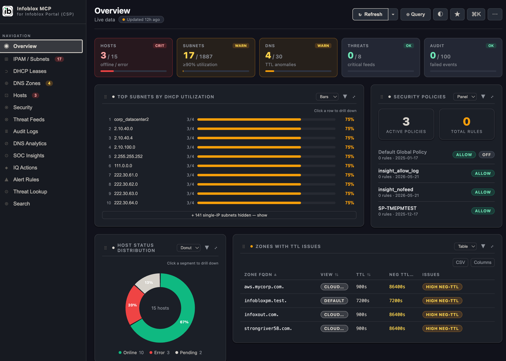

# Infoblox NOC Dashboard

[](LICENSE)
[](https://www.python.org/)
[](Dockerfile)

A local, browser-based NOC dashboard for the Infoblox **BloxOne / CSP** portal. A small
Python bridge talks to the Infoblox cloud over **MCP** (Model Context Protocol), normalizes
the data, and serves a React dashboard at `http://localhost:8080` — subnets, DHCP leases,
DNS zones, hosts, security policies, threat feeds, audit logs, plus an optional natural-
language query box.



> Screenshot placeholder — add `docs/dashboard.png` captured on the mock-data view so no
> real customer data is shown.

The dashboard supports **draggable widgets** (rearrange the layout by dragging) and
**switchable widget visualizations** (toggle a widget between chart/table views).

```
browser ──HTTP──▶ bridge (server.py) ──MCP──▶ csp.infoblox.com/mcp
                       │
                       └── optional: LLM (Groq / OpenAI-compatible) for NL queries
```

The bridge exists because browsers **cannot** call the Infoblox MCP endpoint directly (CORS +
MCP is JSON-RPC/SSE, not REST). The bridge is the server-side hop that holds your API key.

---

## Install from the prebuilt image (recommended)

No source checkout, no build — just Docker. Every push to `master` and every
`vX.Y.Z` tag publishes an image to GitHub Container Registry (GHCR) via
[CI](.github/workflows/docker-publish.yml).

```bash
docker run -d --name infoblox-noc -p 127.0.0.1:8080:8080 \
  -e INFOBLOX_API_KEY="Token <your-key>" \
  --restart unless-stopped \
  ghcr.io/holland-built/infoblox-noc-dashboard:latest
# → http://localhost:8080   (loopback only; drop the 127.0.0.1: prefix to expose on the LAN)
```

Add `-e GROQ_API_KEY=...` to enable the AI query box. Pin a release with a tag
(`:v1.0.0` or `:1.0`) instead of `:latest`.

**Update to the latest published image:**

```bash
docker pull ghcr.io/holland-built/infoblox-noc-dashboard:latest
docker rm -f infoblox-noc           # then re-run the docker run command above
```

> **One-time, so SEs can pull without a login:** the GHCR package defaults to
> private. Make it public at
> `github.com/users/holland-built/packages/container/infoblox-noc-dashboard/settings`
> → *Change visibility* → **Public**. The source repo can stay private; package
> visibility is independent. (Otherwise each user must
> `docker login ghcr.io` with a token that has `read:packages`.)

The convenience script [`run-image.sh`](run-image.sh) wraps the pull + run +
key prompt and re-pulls `:latest` on every run (handy for updating).

---

## Quick start (Docker, from source)

Prereq: Docker installed and running. Use this if you're developing or want to
build locally instead of pulling the published image.

```bash
git clone https://github.com/holland-built/infoblox-noc-dashboard infoblox-noc && cd infoblox-noc
./run.sh
# update later:  git pull && ./run.sh
```

`run.sh` will:
1. Prompt for your **Infoblox API key** (hidden input; adds the `Token ` prefix for you).
2. Prompt for a **Groq API key** (optional — press Enter to skip; only the AI query box needs it).
3. Build the image and start the container.
4. Print `→ http://localhost:8080`.

The API key is **never baked into the image** — it is injected at runtime as an env var.

### Non-interactive (use a `.env`)

```bash
cp .env.example .env        # then edit .env with your keys
docker build -t infoblox-noc .
docker run -d --name infoblox-noc -p 127.0.0.1:8080:8080 --env-file .env -e HOST=0.0.0.0 \
  --restart unless-stopped infoblox-noc   # loopback only; drop 127.0.0.1: to expose on the LAN
```

### Manage

```bash
docker logs -f infoblox-noc     # watch logs
docker rm -f infoblox-noc       # stop + remove
docker start infoblox-noc       # restart existing
PORT=8090 ./run.sh              # run on a different port
```

---

## Getting the keys

### Infoblox API key (required)

1. Sign in to <https://csp.infoblox.com>.
2. Top-right user menu → **User API Keys** → **Create**.
3. Copy the token. Use it as-is — `run.sh` adds the `Token ` prefix automatically.

> **Interactive vs service keys:** an interactive *User API Key* carries your
> user's full account list and enables the in-dashboard account switcher.
> A *Service API Key* is bound to a single account — the dashboard works,
> but the switcher stays hidden.

### Account switching

If your key's user belongs to more than one CSP account (the same list as the
portal's account dropdown), the sidebar footer shows a **⇄ Switch account**
menu with search. Switching mints a scoped session JWT via the CSP
`account_switch` API — the dashboard reloads with that tenant's data and the
JWT auto-refreshes before its ~1 h expiry. The home account always uses the
long-lived key, so you can never be locked out. With a single-account key the
footer shows `single-account key — switching off`.

### LLM key for the query box (optional)

The natural-language query box uses an LLM with tool-calling to fetch live data and answer.
Everything else in the dashboard works **without** it.

**Default provider: Groq — free tier (recommended for demos).**

- Free, no credit card. Sign up at <https://console.groq.com>.
- **API Keys → Create API Key**, paste into the prompt or `.env`.
- Why Groq free tier for demos:
  - **Fast** — LPU inference returns answers near-instantly (no awkward wait on stage).
  - **Free** open models (default `qwen/qwen3-32b`) that support tool-calling.
  - **Generous** rate limits for demo-level traffic.
  - Tradeoff: rate limits + model availability can change — great for demos, not production load.

---

## Using a different LLM provider (no code edits)

The query box works with **any OpenAI-compatible provider** via three env vars. `LLM_API_KEY`
overrides `GROQ_API_KEY` when set.

| Var            | Default            | Purpose                                  |
|----------------|--------------------|------------------------------------------|
| `LLM_API_KEY`  | `GROQ_API_KEY`     | API key for the provider                 |
| `LLM_MODEL`    | `qwen/qwen3-32b`   | Model name                               |
| `LLM_BASE_URL` | _(blank = Groq)_   | OpenAI-compatible base URL               |

Examples (set in `.env`):

```bash
# Groq (default) — leave LLM_BASE_URL blank
GROQ_API_KEY=gsk_...
LLM_MODEL=qwen/qwen3-32b

# OpenAI
LLM_API_KEY=sk-...
LLM_MODEL=gpt-4o-mini
LLM_BASE_URL=https://api.openai.com/v1

# Together.ai
LLM_API_KEY=...
LLM_MODEL=meta-llama/Llama-3.3-70B-Instruct-Turbo
LLM_BASE_URL=https://api.together.xyz/v1

# Local Ollama (from inside Docker, reach the host)
LLM_MODEL=llama3.1
LLM_BASE_URL=http://host.docker.internal:11434/v1
```

The provider must support OpenAI-style **function/tool calling** — the query box routes through
tools (`get_subnets`, `get_hosts`, `search_entity`, …). Native Anthropic API uses a different
tool-call shape and is not drop-in; use an OpenAI-compatible gateway for Claude if needed.

---

## Running without Docker

Requires **Python >= 3.11** (tested on 3.13 — the Docker image pins `python:3.13-slim`).
Node/npx is only needed if you use the `.mcp.json` / `mcp-remote` path; the default
`python server.py` bridge uses the `mcp` pip package and needs no Node.

```bash
python3 -m venv .venv && . .venv/bin/activate
pip install -r requirements.txt
cp .env.example .env        # fill in keys
python server.py            # → http://localhost:8080
```

Set `HOST=0.0.0.0` to expose beyond localhost (the Docker image does this for you).

---

## Environment variables

| Var                | Required | Default                  | Notes                                        |
|--------------------|----------|--------------------------|----------------------------------------------|
| `INFOBLOX_API_KEY` | ✅       | —                        | `Token <key>`; bridge sends as `Authorization`|
| `INFOBLOX_URL`     |          | `https://csp.infoblox.com` | Portal base URL                            |
| `GROQ_API_KEY`     |          | _(empty)_                | Enables the AI query box (Groq)              |
| `LLM_API_KEY`      |          | `GROQ_API_KEY`           | Overrides for any OpenAI-compatible provider |
| `LLM_MODEL`        |          | `qwen/qwen3-32b`         | Model name                                   |
| `LLM_BASE_URL`     |          | _(blank = Groq)_         | OpenAI-compatible endpoint                   |
| `HOST`             |          | `localhost` (`0.0.0.0` in Docker) | Bind address                       |
| `PORT`             |          | `8080`                   | HTTP port                                    |

---

## Security notes

- **Never commit `.env`** (gitignored). Use `.env.example` as the template.
- The image ships no secrets — `.dockerignore` excludes `.env`, `.mcp.json`, and local state.
- The bridge has **no client auth** on its read/query/account endpoints (only `block`/
  `unblock` writes are gated by `DASHBOARD_TOKEN`). CORS is restricted to the loopback
  origin, but that only restrains browsers — anyone who can reach the port can use your
  Infoblox key indirectly. `run.sh`/`run-image.sh` publish on **`127.0.0.1` by default**;
  set `BIND=0.0.0.0` to expose on the LAN, and only behind your own auth/TLS.
- If a token is ever exposed, **rotate it** in the CSP portal — scrubbing files does not revoke it.

See [SECURITY.md](SECURITY.md) for the full policy and how to report a vulnerability, and
[CONTRIBUTING.md](CONTRIBUTING.md) for local setup and the test suite.

## License

Released under the [MIT License](LICENSE).
